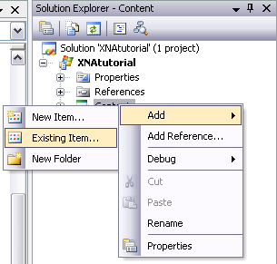
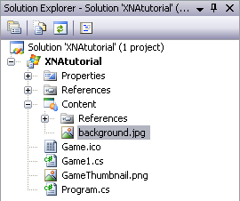
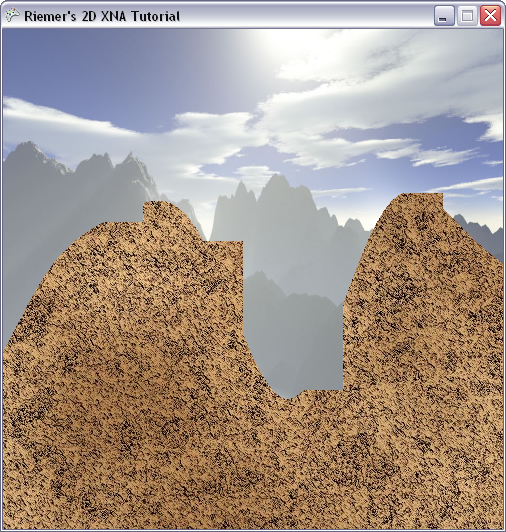

## Drawing a full-screen background image
The first step in creating a 2D game would be to render a 2D image. In XNA, this is very easy to do. As a first example, we’re going to render 2 full screen images to the screen. The first will be the background image, containing the mountain scene. On top of that, we’ll render the foreground image, containing the terrain.

Let’s start by downloading these files, you can find them by clicking on [this link](http://www.riemers.net/Downloads/resources/Series2D/background.jpg) and on [this link](http://www.riemers.net/Downloads/resources/Series2D/foreground.png). To save them on your computer, right-click on one of them, select “Save image as” and save it to a location on your computer. Make sure you know the location where you save it.

Now go to XNA Game Studio 4.0, and find your Solution Explorer. It’s the small rectangle at the top-right of your screen, containing all files of your solution and project. Next, find the Content project in the Solution Explorer, right-click on it and select Add -> Existing Item, as shown in the image below.

In the window that opens, browse to the location where you saved the background image to. Select the image file by clicking on it, and hit the Add button.

This will cause the file to be copied to the Content map of your Project. The file should appear below the Content project of your Solution Explorer as shown in the image below.

With the image loaded into our XNA project, we should create a variable in our code, to which we will link the image. The variable is required, so we can access the image from within our code.

Add this variable to the top of our code, as always immediately above the Game1() method:

    Texture2D backgroundTexture;

We define the variable to be of the Texture2D type. An image is called a Texture or a Sprite in game programming, so that’s where the name comes from. A variable of the Texture2D type can store a link to an image, and can as such be used to render the image or access the color data inside the image (as we’ll do in one of the next chapters).

Obviously, we need to link this variable to the image file we just imported into our XNA project. This is done by putting this line in our LoadContent method:

    backgroundTexture = Content.Load<Texture2D> ("background");

This easy line takes care of loading the image from disk and linking our variable to the image. The “background” argument specified at the end points to the name of the file, which is background.jpg. It doesn’t matter whether your image is in the JPG format, or the BMP, PNG or any other image format. Just import the image into your XNA project and link it to a variable.

With our variable linked to the image, we’re ready to draw the image to the screen. XNA provides a very easy, and very powerful tool for this: the SpriteBatch. This is also a variable, which is already present in your code the moment you start a new XNA project. Find it in your code: it is defined at the top of your code, and initialized in your LoadContent method.

The SpriteBatch is what its name implies: it allows us to render a batch of sprites, of 2D images. For now, we will only render 1, but we can use a single SpriteBatch to render a huge amount of images. Best of all, this is done using the hardware acceleration of your video card!

Since the spriteBatch object is already initialized, we can immediately start drawing our variable. This should be done in the Draw method, but we will create a new, small method for this. The only reason is that otherwise the Draw method would look cluttered at the end of this series of tutorials, as we’ll be rendering lots of images.

So in order to keep things a bit clean, add this new empty method to the end of our code, immediately below the Draw method:

    private void DrawScenery()
    {
    }
    
When we want to draw a 2D image to the screen, we basically have 2 options:

- We specify the position of the top-left corner of the image
- Or we specify a rectangle on the screen where we want the image to be rendered into. In case the size of your image doesn’t match the size of the rectangle, XNA will take care that the image is scaled so it fits in perfectly.

Since we want our background image to cover the whole screen, we’ll go for the second option. We’ll use the first option in the next chapter.

When we want to specify the rectangle that corresponds to the whole screen, we need to know the width and height of the screen. Obviously, since we set the screensize to 500*500 pixels, we already know the size. But of course we want our game to adapt itself automatically whenever we change the screensize later on.

Since we’ll be using the width and height of our screen a lot throughout this series, we’ll add them as 2 variables to the top of our code:

    int screenWidth;
    int screenHeight;
    
Put this code at the end of our LoadContent method, which stores the correct values into these variables:

    screenWidth = device.PresentationParameters.BackBufferWidth;
    screenHeight = device.PresentationParameters.BackBufferHeight;
    
With the size of our screen readily available, we can go back to our DrawScenery method and define a rectangle that covers the entire window:

    Rectangle screenRectangle = new Rectangle(0, 0, screenWidth, screenHeight);
    spriteBatch.Draw(backgroundTexture, screenRectangle, Color.White);
    
The first line creates a rectangle, with its upper-left corner in the (0,0) pixel and having a width and height equal to the width and height of the screen.

__Important:__ in graphics programming, the (0,0) point corresponds to the top-left corner of the screen. The positive X direction is to the right, while the positive Y direction is __down__.

The last line asks the SpriteBatch to draw the image! The line asks the SpriteBatch to draw the backgroundTexture, spanning the entire window. We’ll discuss the last argument in the next chapter, for now you can memorize that Color.White means that the image should be rendered in it’s original colors. The code line adds the background image to the list of images the SpriteBatch has to draw (a list of only 1 image).

This will, however, not immediately draw the image to the screen. The SpriteBatch first needs to be started, then you should add images to its list, and then you should issue the SpriteBatch to render its images. So go to our Draw method, and make sure it looks like this:

    protected override void Draw(GameTime gameTime)
    {
        graphics.GraphicsDevice.Clear(Color.CornflowerBlue);

        spriteBatch.Begin();
        DrawScenery();
        spriteBatch.End();

        base.Draw(gameTime);
    }

The first line clears the window to a color of our choice. Next, we start our SpriteBatch, so we can add images to its list of images to draw. Then we call our DrawScenery method, which adds one image to the list of the SpriteBatch. Finally, we End the SpriteBatch, which effectively asks the SpriteBatch to draw the images in its list to the screen. The last line calls the Draw method of any GameComponents you’ve attached to your Game.

See Recipe 1-6 for more information on GameComponents, and Recipe 1-7 on how multiple GameComponents can communicate with each other through GameServices.

When you run this code, the background image should be shown, nicely stretched so it perfectly fits your window! Now when you set a different window size, the image will adapt itself automatically.

With the background image in place, let’s render the foreground to the screen. In a later chapter, we’ll create the terrain dynamically so we get a new terrain each time we start our program. For now, we will simply load one I saved to file. Start by going through the same 3 steps:

1)import the foreground.png image into the Content entry of your Solution Explorer

2) add the variable to the top of your code:

    Texture2D foregroundTexture;
    
3) and initialize it on your LoadContent method:

    foregroundTexture = Content.Load<Texture2D> ("foreground");

To render this image on top of our background, simply add this line to the end of our DrawScenery method:

    spriteBatch.Draw(foregroundTexture, screenRectangle, Color.White);

Which issues the SpriteBatch to draw the foregroundTexture so it covers the entire screen, in its original colors.

Now when you run this code, you see that the foreground image is rendered nicely on top of the background image!

When you open the foreground.png image in windows explorer, you see that the part above the terrain is transparent. This is why I’ve used the PNG format instead of the JPG format: the JPG format cannot store transparency information. Since we’ve first added the background image to the list of the SpriteBatch, and then the foreground image, the background image will be drawn first.

This is what you should see on your screen:

Our code thus far:

    using System;
    using System.Collections.Generic;
    using System.Linq;
    using Microsoft.Xna.Framework;
    using Microsoft.Xna.Framework.Audio;
    using Microsoft.Xna.Framework.Content;
    using Microsoft.Xna.Framework.GamerServices;
    using Microsoft.Xna.Framework.Graphics;
    using Microsoft.Xna.Framework.Input;
    using Microsoft.Xna.Framework.Media;

    namespace XNATutorial
    {
        public class Game1 : Microsoft.Xna.Framework.Game
        {
            GraphicsDeviceManager graphics;
            SpriteBatch spriteBatch;
            GraphicsDevice device;
            Texture2D backgroundTexture;
            Texture2D foregroundTexture;
            int screenWidth;
            int screenHeight;

            public Game1()
            {
                graphics = new GraphicsDeviceManager(this);
                Content.RootDirectory = "Content";
            }

            protected override void Initialize()
            {
                graphics.PreferredBackBufferWidth = 500;
                graphics.PreferredBackBufferHeight = 500;
                graphics.IsFullScreen = false;
                graphics.ApplyChanges();
                Window.Title = "Riemer's 2D XNA Tutorial";

                base.Initialize();
            }

            protected override void LoadContent()
            {
                spriteBatch = new SpriteBatch(GraphicsDevice);
                device = graphics.GraphicsDevice;

                backgroundTexture = Content.Load<Texture2D>("background");
                foregroundTexture = Content.Load<Texture2D>("foreground");
                screenWidth = device.PresentationParameters.BackBufferWidth;
                screenHeight = device.PresentationParameters.BackBufferHeight;

            }

            protected override void UnloadContent()
            {
            }

            protected override void Update(GameTime gameTime)
            {
                if (GamePad.GetState(PlayerIndex.One).Buttons.Back == ButtonState.Pressed)
                    this.Exit();

                base.Update(gameTime);
            }

            protected override void Draw(GameTime gameTime)
            {
                GraphicsDevice.Clear(Color.CornflowerBlue);

                spriteBatch.Begin();
                DrawScenery();
                spriteBatch.End();

                base.Draw(gameTime);
            }

            private void DrawScenery()
            {
                Rectangle screenRectangle = new Rectangle(0, 0, screenWidth, screenHeight);
                spriteBatch.Draw(backgroundTexture, screenRectangle, Color.White);
                spriteBatch.Draw(foregroundTexture, screenRectangle, Color.White);
            }
        }
    }